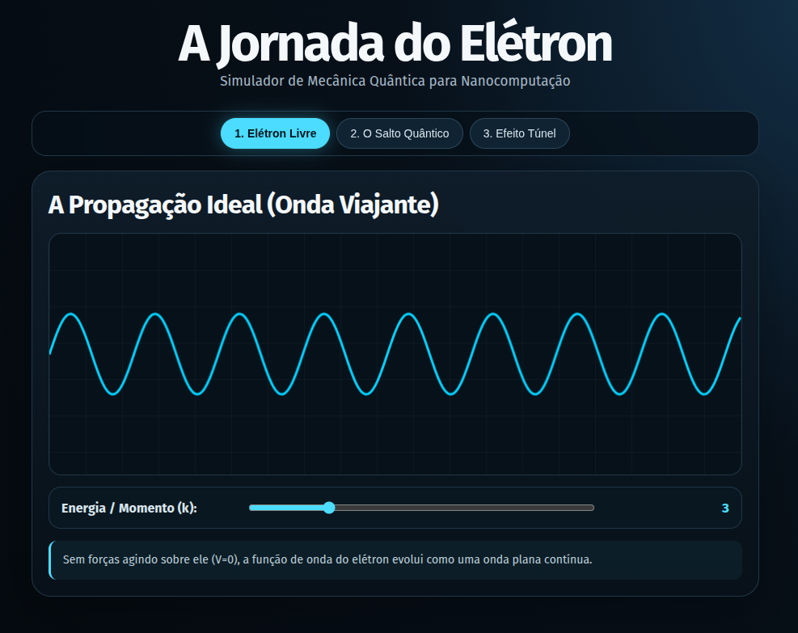
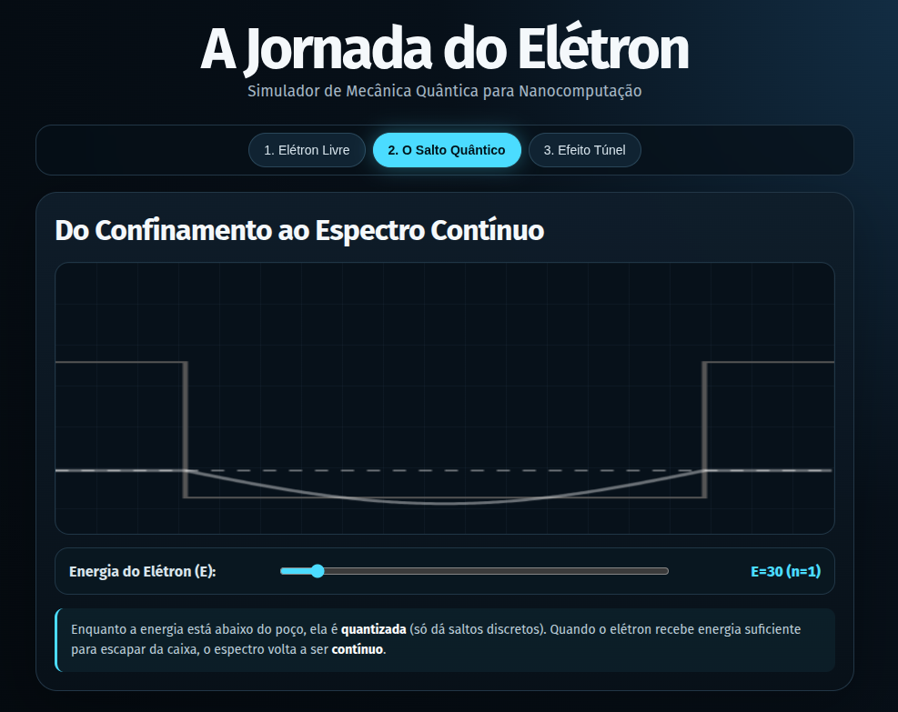
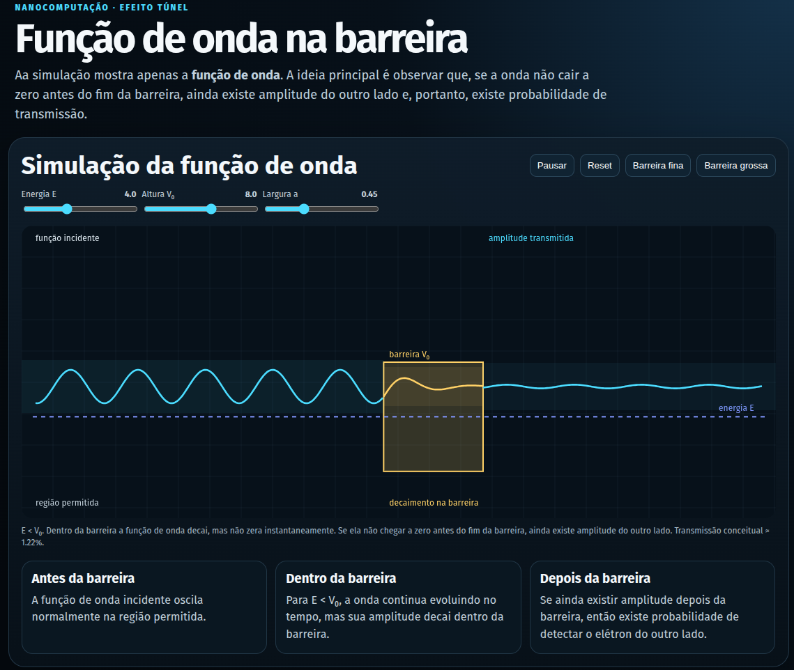

# A Jornada do Elétron — Simulador Interativo de Mecânica Quântica

Pasta do Trabalho 1 (**TP1**) da disciplina de **Nanocomputação e Nanotecnologia Computacional** da Universidade Federal de Minas Gerais (**UFMG**).

## 👥 Autores
* [Gabrielly Santos](https://github.com/gabyxsantos)
* [Julia Luna](https://github.com/Julialunna)
* [Mateus Amaral](https://github.com/MateusAmaralDaSilva)
* [Matheus Soares dos Santos de Freitas](https://github.com/Doctor-Math)

---

## 🎥 Pitch de Apresentação
* **Assista ao vídeo do pitch:** [Acessar Vídeo no Google Drive](https://drive.google.com/file/d/1asvR7Ew_bNQ84-mh07LEDRbv_SOyexnI/view?usp=sharing)
* [Acessar Vídeo no YouTube](https://youtu.be/DuB2aPloLbY?si=Q4YN8kjr-EobP3MY)

---

## 🔬 Sobre o Projeto
Este projeto consiste na criação de um material didático interativo voltado para o ensino dos princípios fundamentais da nanociência e da introdução à mecânica quântica. Através de uma simulação visual construída em HTML5 e JavaScript, o simulador **"A Jornada do Elétron"** demonstra como as regras do mundo macroscópico de Newton dão lugar aos fenômenos ondulatórios e quânticos em nanoescala.

### 🌟 Cenários Disponíveis no Simulador

1. **Elétron Livre ($V=0$):** Demonstra a propagação da função de onda de um elétron livre sob ausência de forças externas, obedecendo à Equação de Schrödinger e evidenciando o comportamento ondulatório previsto por De Broglie ($\lambda = h/p$).
   
   

      
     <em>Figura 1: Simulação da propagação da onda de um elétron livre.</em>
   

2. **O Salto Quântico (Poço de Potencial Finito):** Explora o confinamento quântico. Quando a energia está abaixo da altura do poço, os estados são quantizados ($n=1, 2, 3\dots$). Ao receber energia suficiente para superar a barreira, o espectro do elétron torna-se contínuo.
   
   

      
     <em>Figura 2: Confinamento quântico e transição para o espectro contínuo.</em>
   

3. **Efeito Túnel:** Simula o comportamento da onda quântica ao encontrar uma barreira de potencial. Em vez de refletir completamente como na física clássica, a função de onda decai exponencialmente, permitindo que o elétron "vaze" para o outro lado se a barreira for fina o suficiente.
   
   

      
     <em>Figura 3: Decaimento exponencial da onda através de uma barreira de potencial.</em>
   

---

## 📂 Estrutura de Arquivos
* `A_Jornada_do_Eletron.html`: Arquivo principal contendo a aplicação web interativa com os três cenários e estilização avançada.
* `simulacao_efeito_tunel.html`: Arquivo específico da simulação do efeito túnel, com a visualização da onda atravessando uma barreira de potencial.
* `A Jornada do Elétron - slides TP1.pdf`: Apresentação em slides utilizada para o suporte teórico e gravação do pitch de apresentação.

---

## 🚀 Como Executar
1. Clone este repositório ou faça o download dos arquivos.
2. Abra qualquer um dos arquivos HTML diretamente em um navegador web moderno (Google Chrome, Firefox, Edge, etc.).
3. Para executar a simulação do efeito túnel, abra especificamente o arquivo `simulacao_efeito_tunel.html`.
4. Interaja com os controles de espessura e altura da barreira para observar em tempo real o comportamento da função de onda durante o fenômeno de tunelamento quântico.
5. Caso queira ver a versão completa do projeto, abra `A_Jornada_do_Eletron_mesmo_conteudo_novo_design.html` ou `A_Jornada_do_Eletron.html`.
